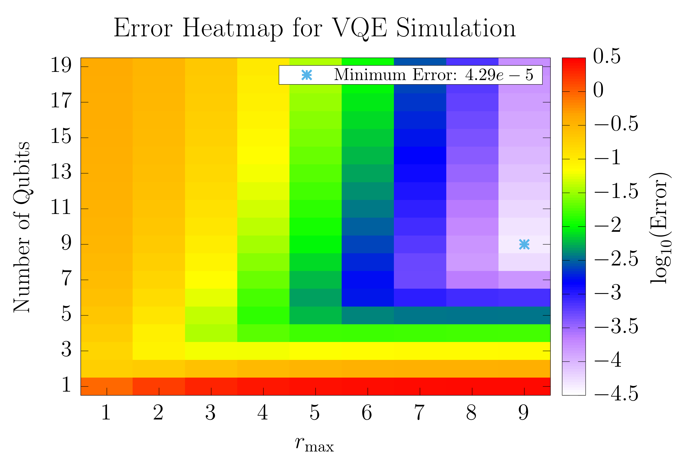
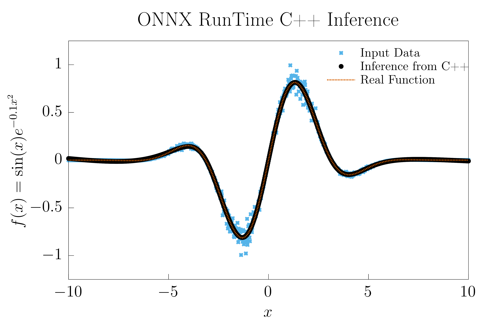

# Kyle Salamone
---

Experimental Physics PhD student working on large-scale detector data analysis, machine learning systems, and computational physics. Focused on designing and deploying scientific and ML pipelines in high-performance research environments, with emphasis on quantum information and data-driven modeling of physical systems.

---

## What I Work On

- Quantum and computational physics (variational algorithms, Hamiltonian simulation)
- Machine learning systems engineering (PyTorch → ONNX → C++ inference pipelines)
- Scientific computing infrastructure (reproducible visualization and analysis tooling)

---

## Featured Projects

### Quantum Eigensolver – Hydrogen VQE Study
[View Repository](https://github.com/ksalamone59/variational-quantum-eigensolver-hydrogen-study)

Variational Quantum Eigensolver implementation for hydrogen ground-state estimation with classical diagonalization benchmarking and scaling analysis.

*Focus: quantum algorithms, Hamiltonian simulation, optimization landscapes, scaling behavior*

---

### PyTorch → ONNX → C++ Inference Pipeline
[View Repository](https://github.com/ksalamone59/pytorch-onnx-cpp-pipeline)

End-to-end ML deployment pipeline converting trained PyTorch models into ONNX format and executing inference in C++ using ONNX Runtime.

*Focus: model deployment, cross-language inference, performance-oriented ML systems*

---

### Scientific Plotting Infrastructure
[View Repository](https://github.com/ksalamone59/gnuplot_latex_utils)

Reproducible gnuplot + LaTeX system for consistent publication-quality scientific figures across projects.

*Focus: scientific visualization, automation, reproducibility*

## Main Results

 

Output from characterizing VQE as a solution to the Hydrogen atom's ground state. Quantifying the minimum achievable error as a function of the number of qubits and maximum radius r in the Hamiltonian approximation

 

Output from the ONNX ML pipeline. Showcases:
- Noisy input data to the C++ inference  
- The output C++ inference  
- The true function

Both plots were created using my gnuplot latex utilities repository.
## System View

Physics Simulation → ML Modeling → Deployment Runtime → Scientific Visualization

---

## Tools & Stack
Python · PyTorch · Qiskit · ONNX · C++ · Eigen · CMake · Gnuplot · LaTeX · Linux

---

## Contact
GitHub: ksalamone59
 
[LinkedIn](https://www.linkedin.com/in/kyle-salamone-a834b6205/)
