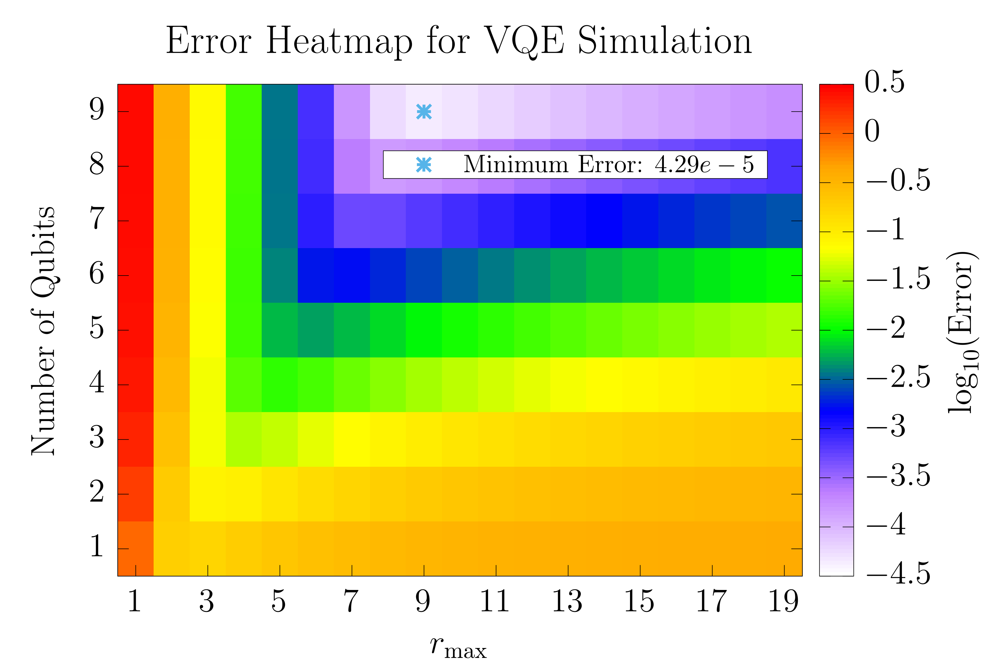
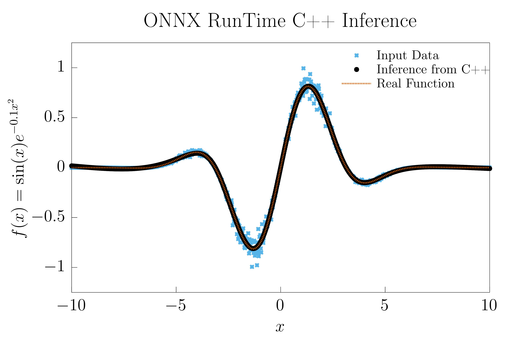

# Kyle Salamone

Experimental Physics PhD student working on large-scale detector data analysis, machine learning systems, and computational physics. Focused on designing and deploying scientific and ML pipelines in high-performance research environments, with emphasis on quantum information and data-driven modeling of physical systems.

*Current PhD research is proprietary — projects here represent independent work.*

---

## What I Work On

- Quantum and computational physics (variational algorithms, Hamiltonian simulation)
- Machine learning systems engineering (PyTorch → ONNX → C++ inference pipelines)
- Scientific computing infrastructure (reproducible visualization and analysis tooling)

---

## Highlights
- Built C++ ML inference system achieving **9.4M samples/sec (16× speedup)** in batched vs per sample inference
- Quantified **VQE error decomposition** (discretization vs variational limits)
- Designed **end-to-end scientific pipelines** (simulation $\rightarrow$ ML $\rightarrow$ deployment $\rightarrow$ visualization)

---

## Featured Projects

### Quantum Eigensolver – Hydrogen VQE Discretization Study
[View Repository](https://github.com/ksalamone59/variational-quantum-eigensolver-hydrogen-study)

- Quantified VQE vs classical ground-state solutions under identical discretization by isolating **variational vs discretization error contributions**, showing up to **38% error is representation-bound** in low-qubit regimes.

- **Why this Matters**: Identifies when VQE improvements should target problem representation (discretization/encoding) rather than circuit design or optimization.

*Focus: quantum algorithms, Hamiltonian discretization, error decomposition, variational landscapes, scaling behavior*

---

### PyTorch → ONNX → C++ Inference Pipeline
[View Repository](https://github.com/ksalamone59/pytorch-onnx-cpp-pipeline) 

- C++ inference engine with pre-allocated tensor reuse and singleton session 
management for zero-overhead-per-call ORT deployment. Includes statistically 
rigorous benchmarking via Welford online variance estimation — batched inference 
achieves 9.4M samples/s, ~16× over sequential baseline. Engineering patterns 
drawn from production physics reconstruction constraints.

- **Why this Matters**: Demonstrates full pipeline from training in Python to an environment with highly optimized, Python-free inference; and studies the overhead implications of batched vs per sample inference.

*Focus: ML deployment, C++ inference systems, performance benchmarking*

---

### Scientific Plotting Infrastructure
[View Repository](https://github.com/ksalamone59/gnuplot_latex_utils)

- Reproducible gnuplot + LaTeX system for consistent publication-quality scientific figures across projects.

- **Why this Matters**: Provides a consistent visual language across all projects via a shared template and scripting layer

*Focus: scientific visualization, automation, reproducibility*

---

## Main Results

 

This heatmap shows the output from characterizing VQE as a solution to the Hydrogen atom's ground state. Quantifying the minimum achievable error as a function of the number of qubits and maximum radius r in the Hamiltonian approximation

 

Output from the ONNX ML pipeline. Showcases:
- Noisy input data to the C++ inference  
- The output C++ inference  
- The true function

Both plots were created using my gnuplot latex utilities repository.
## System View

Physics Simulation → ML Modeling → C++ Deployment → Scientific Visualization

---

## Tools & Stack
Python · PyTorch · Qiskit · ONNX · C++ · Eigen · CMake · Gnuplot · LaTeX · Linux

---

## Contact
GitHub: ksalamone59
 
[LinkedIn](https://www.linkedin.com/in/kyle-salamone-a834b6205/)
