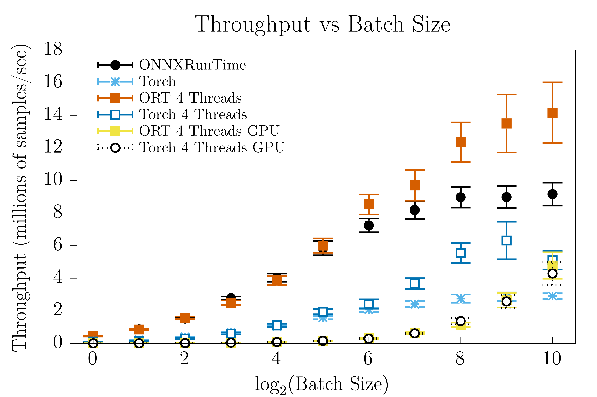

# Kyle Salamone

Experimental Physics PhD student working on large-scale detector data analysis, machine learning systems, and computational physics. Focused on designing and deploying scientific and ML pipelines in high-performance research environments, with emphasis on quantum information and data-driven modeling of physical systems.

*Current PhD research is proprietary — projects here represent independent work.*

---

## What I Work On

- High-performance computing
- Quantum and computational physics (variational algorithms, Hamiltonian simulation)
- Machine learning systems engineering (PyTorch → ONNX → C++ inference pipelines)
- Scientific computing infrastructure (reproducible visualization and analysis tooling)

---

## Highlights
- Developed a backend-agnostic C++ inference profiler (ONNX Runtime + LibTorch) with zero-allocation hot path; achieved **13.97M samples/sec** and **R² = 0.9999** cross-backend numerical agreement
- Built C++ ML inference system achieving **9.4M samples/sec (16× speedup)** in batched vs per sample inference
- Quantified **VQE error decomposition** (discretization vs variational limits)
- Designed **end-to-end scientific pipelines** (simulation $\rightarrow$ ML $\rightarrow$ deployment $\rightarrow$ visualization)

---

## Featured Projects

### C++ ML Inference Profiler Engine
[View Repository](https://github.com/ksalamone59/inference-profiler)

- Built a backend-agnostic C++ framework for benchmarking and comparing ML inference engines in Python-free deployment environments. Supports ONNX Runtime and LibTorch through a common abstract interface, CPU and GPU inference modes, configurable threading, reusable tensor allocation, statistical benchmarking (Welford online variance), backend comparison, and automated batch-size sweep studies.

- Measured up to **13.97M samples/sec** using ONNX Runtime with four threads and demonstrated **R² = 0.9999** agreement between ONNX Runtime and LibTorch backends.

- **Why this matters:** Real-world ML deployment often requires choosing between inference runtimes with competing performance, portability, and maintenance tradeoffs. This project provides a reproducible framework for quantifying those tradeoffs, validating numerical consistency across backends, and identifying bottlenecks before deployment into performance-critical environments.

*Focus: C++ systems engineering, ML deployment, performance optimization, benchmarking methodology, backend abstraction, GPU vs CPU inferencing*

---

### PyTorch → ONNX → C++ Inference Pipeline
[View Repository](https://github.com/ksalamone59/pytorch-onnx-cpp-pipeline) 

- C++ inference engine with pre-allocated tensor reuse and singleton session management for zero-overhead-per-call ORT deployment. Includes statistically rigorous benchmarking via Welford online variance estimation — batched inference achieves 9.4M samples/s, ~16× over sequential baseline. Engineering patterns drawn from production physics reconstruction constraints.

- **Why this matters:** Demonstrates the complete path from model development in Python to high-performance deployment in a production-style C++ environment, while quantifying the performance impact of batching, memory reuse, and inference-engine design choices.

*Focus: ML deployment, C++ inference systems, performance benchmarking*

---

### Quantum Eigensolver – Hydrogen VQE Discretization Study
[View Repository](https://github.com/ksalamone59/variational-quantum-eigensolver-hydrogen-study)

- Variational Quantum Eigensolver (VQE) study of the hydrogen atom ground state, directly benchmarked against a classical eigenvalue solver under identical finite-difference discretization.

- **Why this matters:** Separates algorithmic limitations from numerical discretization effects, helping clarify where quantum resources provide meaningful improvements and where classical approximation error dominates observed performance.

*Focus: quantum algorithms, Hamiltonian discretization, error decomposition, variational landscapes, scaling behavior*

---

### Scientific Plotting Infrastructure
[View Repository](https://github.com/ksalamone59/gnuplot_latex_utils)

- Reproducible gnuplot + LaTeX system for consistent publication-quality scientific figures across projects.

- **Why this matters:** Reproducible visualization infrastructure reduces manual figure generation, improves consistency across projects, and makes scientific results easier to verify, maintain, and communicate.

*Focus: scientific visualization, automation, reproducibility*

---

## Main Results

    

Results from the C++ ML Inference Profiler Engine showing throughput as a function of batch size for ONNX Runtime and LibTorch backends under single-threaded and four-threaded execution. ORT consistently outperforms LibTorch at the same thread count. Threaded variants have higher variance due to synchronization overhead. 

 

This heatmap shows the output from characterizing VQE as a solution to the Hydrogen atom's ground state. Quantifies the minimum achievable error as a function of qubit count and maximum radius r in the Hamiltonian discretization.

 

Output from the PyTorch → ONNX → C++ inference pipeline showing:
- Noisy input data to the C++ inference  
- The output C++ inference  
- The true function

All figures shown above were generated using the Scientific Plotting Infrastructure repository.
## System View

Physics Simulation → Data Generation → ML Training → Optimized C++ Inference → Scientific Visualization

---

## Tools & Stack
Python · PyTorch · Qiskit · ONNX · C++ · Eigen · CMake · Gnuplot · LaTeX · Linux

---

## Contact
GitHub: ksalamone59
 
[LinkedIn](https://www.linkedin.com/in/kyle-salamone-a834b6205/)
